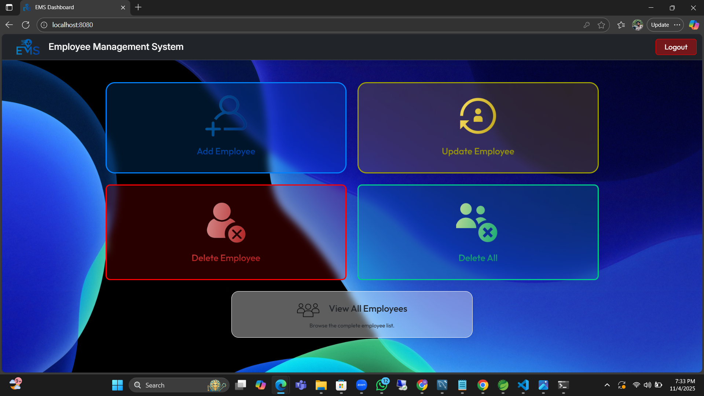
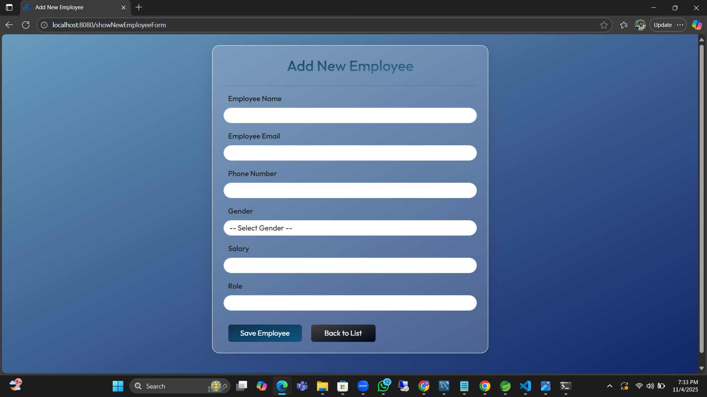
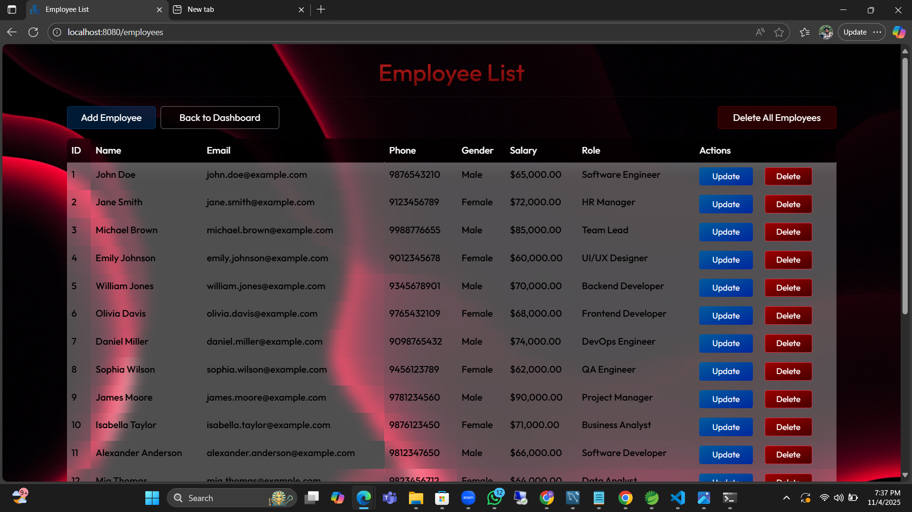
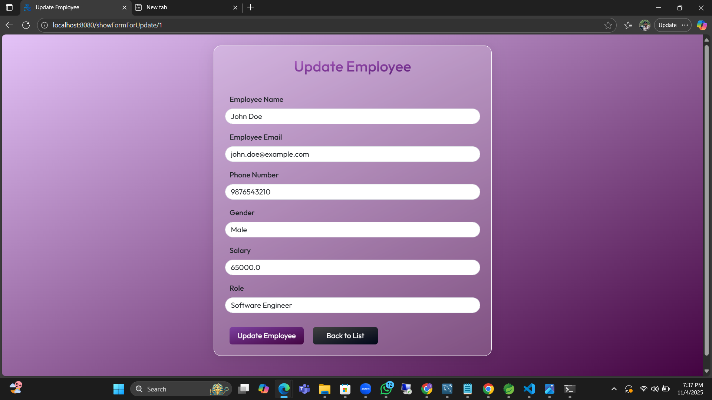
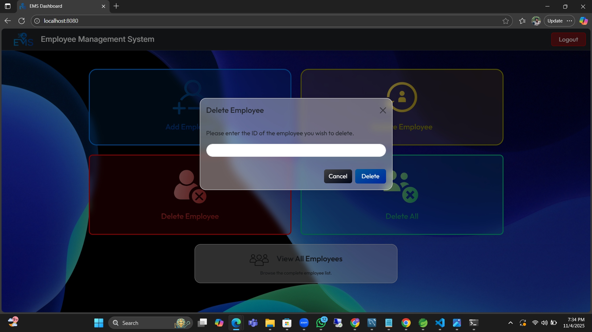
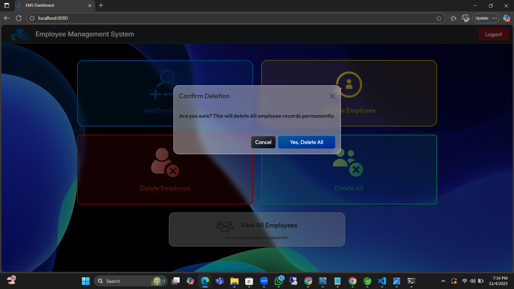
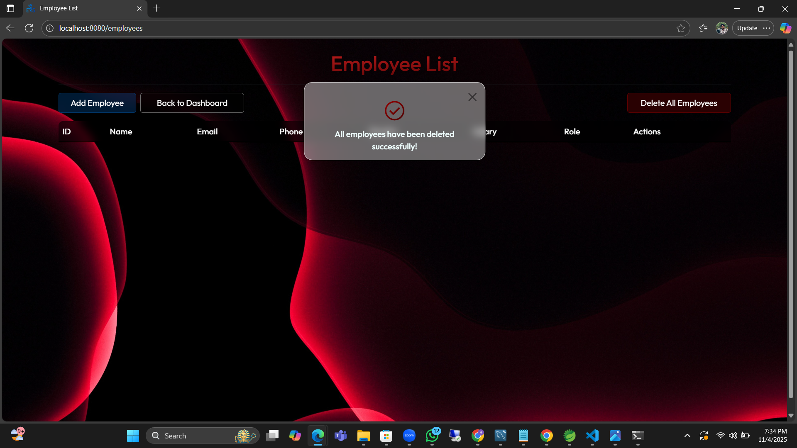

1. Login Page
   

2. Registration Page
   

3. EMS Dashboard
   

4. Add New Employee Page
   

5. Employee List Page
   

6. Update Employee Page
   

7. Delete Employee
   

8. Delete All Employee
   

9. Delete Success
   

